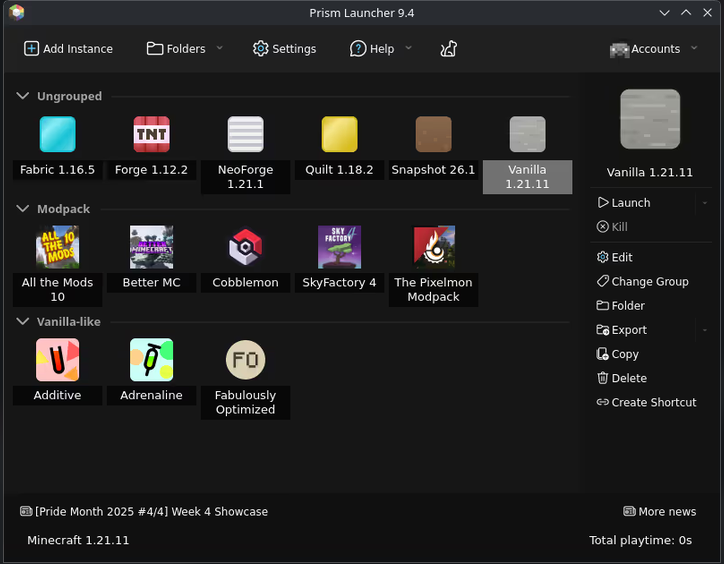

So technically this should be the second page of the gitbook.
This page will tell the reader/user/visitor of the website which launcher to use and how to set it up.

content of the page :

There are multiple launchers and clients that can be used to launch minecraft. We have an official minecraft launcher as well but it is quiet buggy.

Some of the famous Minecraft clients are :
1. Lunar Client : // write some information about lunar client how good performance it has, has inbuilt mod and resource pack downloader from both Modrinth and CurseForge. And that it is also used by many youtubers like : Flowtives, Swight, ImMixed etc.
2. Dawn Client (Previously known as Feather Client) : Give some information about the client and also has inbuilt mod and resource pack downloader from both Modrinth and Curseforge. Used By youtubers like : Dolphin (dol9hin), Tai_ etc. But i saw youtube videos reviewing dawn client and they say that the performance has downgraded but I'll give a benefit of the doubt as the client is still work in progress I hope they fix the performance issues.
3. Modrinth launcher : Write some information about modrinth launcher
4. Prism Launcher : One of the best free and open-source launcher for minecraft and personally used by me. I find it very easy to make different minecraft instances in prism launcher than in lunar client as it is comparatively easy as well as the UI of prism launcher is very easy to understand for any beginner(For this guide i'll show the setup of prism launcher).

# Prism Launcher Setup :
1. download the launcher using the following link :
  [text](https://prismlauncher.org/)
2. Install the according to the Operating system you use
   
   They Have command line installer as well just scroll down the download page you would be able to spot it.
3. After Downloading the launcher and Sign In using your microsoft account on which you have bought the Minecraft game.
4. You should see something like this :

Ignore all the modpacks and stuff installed it should be empty for you as u have not created an instance yet.
5. Click on Add Instance button and a windows like this will pop up
   
6. Select what version of minecraft you want to play and after selecting the version scroll down and you will se mod loader option By Default it is set at None so you have to select Fabric (latest version)
## Note (Create a gtbook note): We are using fabric mod loader but the mods showcase in the website also support other mod loaders as well to check whether the particular mod support your choice of mod loader check the description of that particular mod as i have written what mod support what mod loader.

7. After selecting Everything properly, Click OK and it should start downloading the assets and i a few minutes your instance will be ready.
8. After download, it should look like this
  
