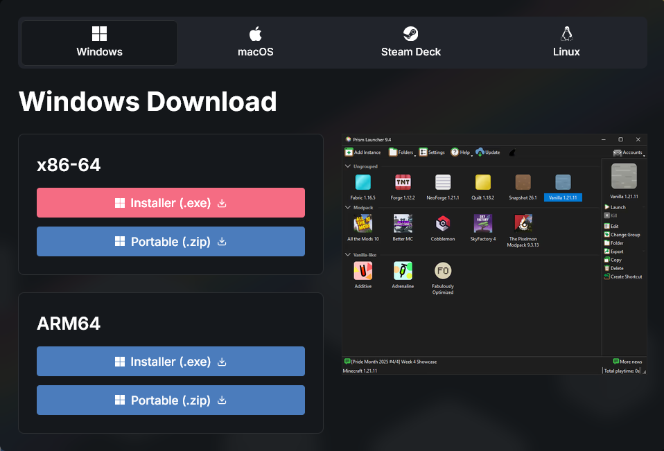
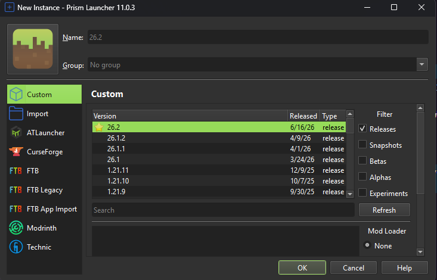
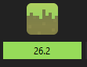

# Launcher setup

> Every Minecraft setup starts with a launcher. This page covers the most popular options and walks through setting up Prism Launcher — the launcher used throughout this guide.

## Choosing a launcher

There are multiple launchers and clients available for Minecraft. The official Minecraft launcher works but is widely considered unreliable for modded play.

Here are the most popular options.

***

### Lunar Client

An all-in-one client popular among competitive players and content creators.

**Key features:**

* Built-in performance and cosmetic mods
* Integrated mod and resource pack browser
* Supports both Modrinth and CurseForge
* Solid out-of-the-box performance
* Used by content creators such as Flowtives, Swight, and ImMixed

***

### Dawn Client

An all-in-one client formerly known as Feather Client, with an integrated mod ecosystem.

**Key features:**

* Built-in mod and resource pack downloader
* Supports both Modrinth and CurseForge
* Used by content creators such as Dolphin (dol9hin) and Tai\_


**Note:** Some recent reviews suggest that Dawn Client's performance may have declined since the rebrand. The client is still under active development and these issues may improve over time.


***

### Modrinth Launcher

A clean, minimal launcher from the Modrinth team with tight ecosystem integration.

**Key features:**

* Lightweight and fast
* Tight integration with Modrinth
* Straightforward instance management
* Open source

***

### Prism Launcher

A free and open-source launcher with an intuitive interface. **This is the launcher used throughout this guide.**

**Key features:**

* Free and fully open source
* Easy instance creation and management
* Beginner-friendly interface
* Supports multiple Minecraft versions side by side
* Works on Windows, macOS, and Linux

***

## Prism Launcher setup


**Prerequisites:** Make sure you own Minecraft on a Microsoft account before starting.


### 1. Download Prism Launcher

1. Go to the [Prism Launcher website](https://prismlauncher.org/)
2. Download the installer for your operating system:
   * **Windows** — `.msi` or `.exe` installer
   * **macOS** — `.dmg` disk image
   * **Linux** — Flatpak, AppImage, or package manager
3. Run the installer and follow the prompts


**Tip:** A command-line installer is also available — scroll down the download page to find it.


### 2. Sign in

1. Open Prism Launcher
2. Click the account/profile area
3. Sign in with the **Microsoft account** that owns your Minecraft purchase

### 3. Confirm sign-in

After signing in you should see the main launcher window. It will appear empty since no instances have been created yet.

### 4. Create an instance

1. Click the **Add Instance** button
2. A configuration window will appear where you choose your Minecraft version and mod loader

### 5. Select version and mod loader

1. Choose the **Minecraft version** you want to play
2. Scroll down to the **Mod loader** section (default is **None**)
3. Select **Fabric** — latest version


**Note:** This guide showcases mods using Fabric, but many of the mods covered also support other mod loaders. Check the description of each individual mod page to confirm compatibility with your preferred loader.


### 6. Confirm and install

1. Click **OK** to start the download
2. Prism Launcher will fetch the Minecraft assets, Fabric loader, and any required files
3. Wait a few minutes for the download to finish

Once complete, you will see the new instance in your launcher — ready to play.

***

## What's next?

Your launcher is ready. Head to the [Performance](../performance/overview.md) section to start modding, or browse [Setups](../setups/overview.md) for curated mod combinations.
